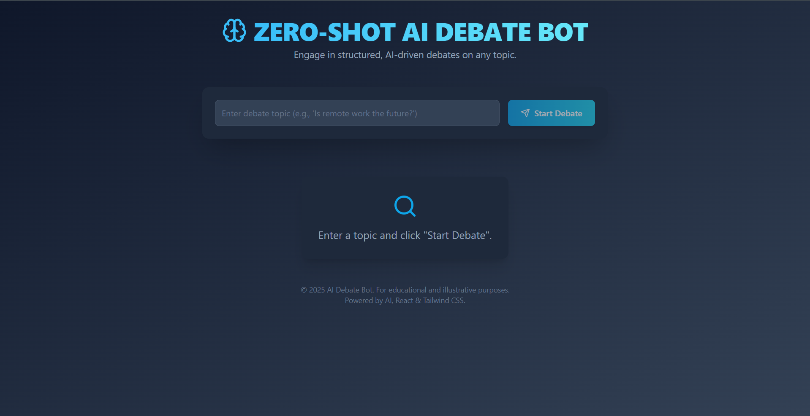
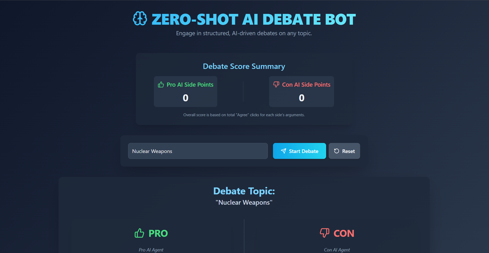
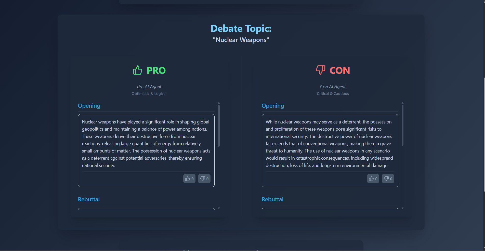

# 🧠 Zero-Shot AI Debate Bot

A fully functional web application that simulates AI-powered debates on any topic using Large Language Models (LLMs) and Retrieval-Augmented Generation (RAG). The platform generates structured, multi-perspective arguments (Pro and Con) with user interaction features like counterpoints, feedback, and scoring.

## 🌐 Demo

> Enter a debate topic and watch AI generate compelling opening statements, rebuttals, and conclusions from both sides — with like/dislike feedback and vote counts.






---

## 🏗️ Project Structure

```
zero-shot-ai-debate-bot/
├── backend/                 # FastAPI Backend
│   ├── app/
│   │   ├── main.py
│   │   ├── routes/
│   │   │   └── debate.py
│   │   ├── schema/
│   │   │   └── debate.py
│   │   ├── services/
│   │   │   └── debate_engine.py
│   │   └── utils/
│   │       └── rag_wikipedia.py
│   └── requirements.txt
├── frontend/                # React + Vite + Tailwind Frontend
│   ├── src/
│   │   ├── components/
│   │   │   ├── Header.jsx
│   │   │   ├── TopicInput.jsx
│   │   │   ├── DebateDisplayArea.jsx
│   │   │   ├── ArgumentColumn.jsx
│   │   │   ├── ArgumentCard.jsx
│   │   │   ├── OverallVoteCounter.jsx
│   │   │   └── Footer.jsx
│   │   ├── App.jsx
│   │   └── main.jsx
│   └── vite.config.js
└── README.md
```

---

## ⚙️ Features

- ✅ **Zero-Shot Topic Understanding**
- ✅ **Structured Debate Format**
- ✅ **Dual AI Personas (Pro vs. Con)**
- ✅ **Like/Dislike Feedback System**
- ✅ **Vote Counter Display**
- ✅ **FastAPI Backend with OpenRouter API**
- ✅ **Wikipedia Retrieval (RAG)**

---

## 🚀 Getting Started

### 🔧 Prerequisites

- Python 3.10+
- OpenRouter API Key

---

### ▶️ Frontend Setup

```bash
cd frontend
npm install
npm run dev
```

---

### 🧠 Backend Setup (FastAPI)

```bash
cd backend
python -m venv venv
source venv/bin/activate  # or venv\Scripts\activate on Windows
pip install -r requirements.txt
uvicorn app.main:app --reload
```

---

## 🔁 API Endpoints

### POST `/debate/`

**Request:**

```json
{
  "topic": "Is AI dangerous?"
}
```

**Response:**

```json
{
  "topic": "Is AI dangerous?",
  "pro": {
    "opening": "...",
    "rebuttal": "...",
    "closing": "..."
  },
  "con": {
    "opening": "...",
    "rebuttal": "...",
    "closing": "..."
  }
}
```

---

## 📦 Technologies Used

### Frontend

- React + Vite
- Tailwind CSS
- Axios
- Lucide Icons

### Backend

- FastAPI
- Pydantic
- OpenRouter / OpenAI API
- Wikipedia API (for RAG)

---

## 🤖 Author

**Team BotMinds**

- **Ishatva Singh Panwar**
- **Pratham Bajaj**
- **Hritvik Mohan**
- **Keith Kaur Malli**

B.E., NITTE Meenakshi Institute of Technology

---
